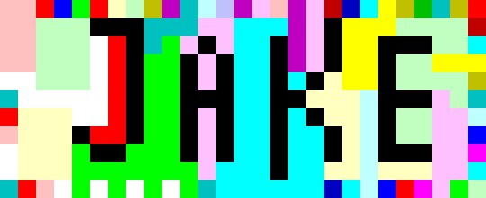

This image  is a [Piet](https://www.dangermouse.net/esoteric/piet.html) program that contains a secret message.

Large version:

# Running the program

To run: install `npiet` and run `npiet jake.png`. The large version also works.

# npiet Installation

I compiled npiet on Ubuntu Linux and used `npietedit` to write the program.
https://github.com/gleitz/npiet

I used ImageMagick's `convert` tool to create the PNG file:

        convert jake.ppm jake.png

# How the heck do you even write this?

The language, being esoteric, is deliberately difficult to work with.

First and biggest gotcha is that a color is not a command - a color CHANGE is a command.
That makes the code hard to read because it always depends on what came before it.

At first I tried doing it with only 1px border all the way around and it just did not all fit, so I enlarged to 2px around.
Constructing large numbers out of smaller ones with some math made it more fun and provided more of a colorful stripe border.

I learned at the END of this program the power of whitespace to make the program more readable:
After whitespace, the next block has NO effect, no that allows you to reset to any color you want.
The last two turns look identical and that allows you to much more easily understand them as the same command twice.

A gotcha is that when turning at each corner, the codel chooser (CC) also switches left to right.
For this style of program wrapping around clockwise, you want the CC to stay on the left,
so you don't accidentally allow taller blocks to cause the interpreter to stray off the border
into whitespace or other decorative space. So a SWITCH command at each corner helps counteract that problem.

Another challenge is ending the program.
You really have to understand color blocks to be able to end a program and not have it enter an infinite loop.
You have to trap the program in a block that has only black at all of its extreme ends.
The J here proved to be just enough for the task. :)
Explicit pointer turns allowed the program to require no black except in the inner letters.

# Overview

(See `trace` for full details)

Message:

      Hi Jake!
      ASCII: [72, 105, 32, 74, 97, 107, 101, 33]

H: 72 = 64 + 8 = (8 * 8) + 8

      push(8)
      dup -> 8 8
      dup -> 8 8 8
      dup -> 8 8 8 8
      mul -> 64 8 8
      add -> 72 8
      out(char) -> 8

i: 105 = 8*(8+5)+1

      dup -> 8 8
      dup -> 8 8 8
      push(5) -> 5 8 8 8
      add -> 13 8 8
      mult -> 104 8
      push 1 -> 1 104 8
      add -> 105 8
      out(char) -> 8

space: 32

      push(4) -> 4 8
      mult -> 32
      dup -> 32 32
      out(char) -> 32

J: 74 = 32 + 32 + 10

      dup -> 32 32
      push 10 -> 10 32 32
      add -> 42 32
      add -> 74
      dup -> 74 74
      out(char) -> 74

a: 97 = 74 + 23

      dup -> 74 74
      push 3 -> 3 74 74
      div -> 24 74
      push(1) -> 1 24 74
      sub -> 23 74
      add -> 97
      dup -> 97 97
      out(char) -> 97

k: 107

      push(10) -> 10 97
      add -> 107
      dup -> 107 107
      out(char) -> 107

e: 101

      push(6) -> 6 107
      sub -> 101
      out(char) -> empty

!: 33

      push(33) -> 33
      out(char) -> empty

Final turns

      cerrated green edge for decoration
      bottom right corner would have turned automatically, but:
      for nicely filled corner, use an explicit pointer turn:
      whitespace to reset color
      darkening pink-red pair to push a 1
      +3 hue change, +1 darkness (to dark cyan) = pointer turn
      -> now pointing upward at corner (use the 1)
      repeat to turn right into the J

End of program

      enter the block inside J from the left
      only right-most boundary is black -> turn down
      only down-most boundary is black -> turn left
      only left-most boundary is black (hook at end of J) -> turn up
      only up-most boundary is black (top of J) -> end of program
